# Quickstart Tutorial

This tutorial describes couple of simple, but useful use case with Talend components for Couchbase.
Here we assume that components bundle successfully registered as it described in README of this repository.

## Migrating MySQL table to Couchbase bucket

Lets start from loading sample data into your MySQL instance. Classic employee sample for MySQL should be enough:

    $ git clone git://github.com/datacharmer/test_db.git
    $ cd test_db
    $ mysql -uroot -proot < employees.sql

In our case the username is `root` and password `root`.

Verify that everything successfully imported:

    $ mysql -t -s -uroot -proot employees
    MariaDB [employees]> show tables;
    +----------------------+
    | Tables_in_employees  |
    +----------------------+
    | current_dept_emp     |
    | departments          |
    | dept_emp             |
    | dept_emp_latest_date |
    | dept_manager         |
    | employees            |
    | salaries             |
    | titles               |
    +----------------------+
    MariaDB [employees]> describe employees;
    +------------+---------------+------+-----+---------+-------+
    | Field      | Type          | Null | Key | Default | Extra |
    +------------+---------------+------+-----+---------+-------+
    | emp_no     | int(11)       | NO   | PRI | NULL    |       |
    | birth_date | date          | NO   |     | NULL    |       |
    | first_name | varchar(14)   | NO   |     | NULL    |       |
    | last_name  | varchar(16)   | NO   |     | NULL    |       |
    | gender     | enum('M','F') | NO   |     | NULL    |       |
    | hire_date  | date          | NO   |     | NULL    |       |
    +------------+---------------+------+-----+---------+-------+
    MariaDB [employees]> select count(*) from employees;
    +----------+
    | count(*) |
    +----------+
    |   300024 |
    +----------+

Okay. Now lets open Talend Studio (for example DI version) and create empty job:

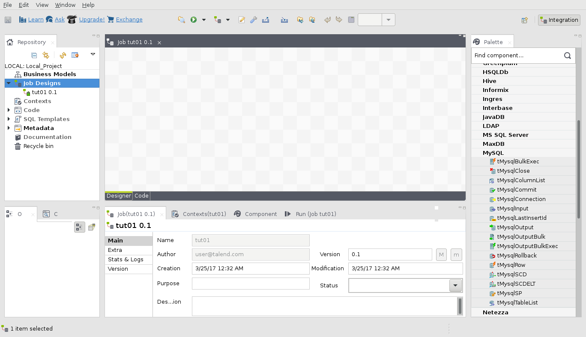

Drag `tMysqlInput` component from the section `Databases\MySQL`:

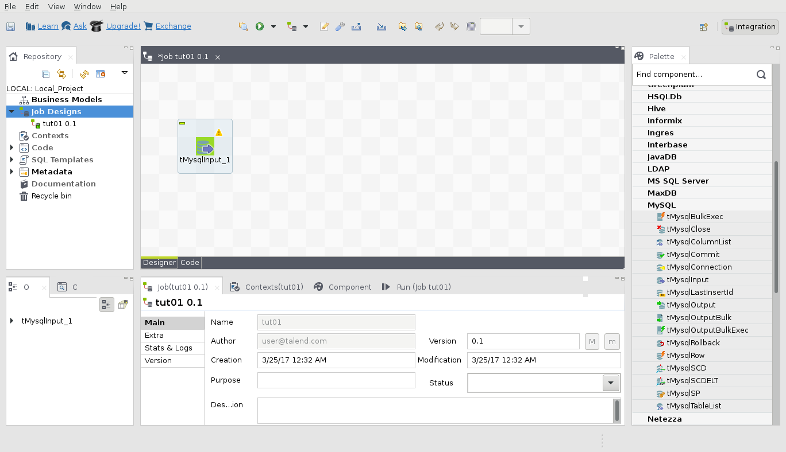

Open component configuration, and fill in connection credentials of you MySQL instance.
Also specify `employees` for table. In "Query" text area, put the following code:

    "select * from employees"

Note, that the values should be valid Java literals (e.g. strings with double quotes).

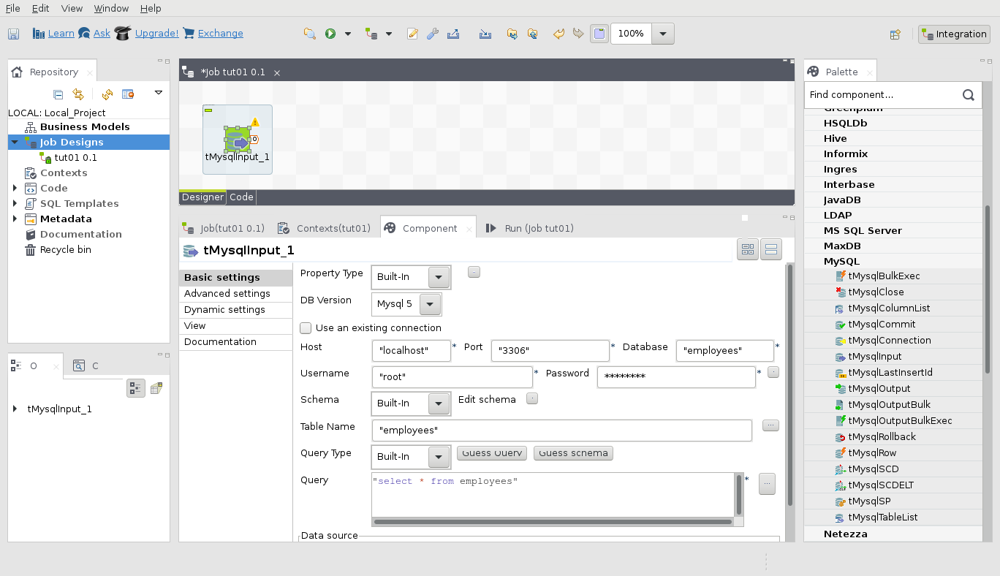

Now, click "Guess schema" button and check the Talend schema, the component has infered:

Note, that for date fields, it shows non-grayed cells in "Date Pattern" column. That
means, they have to be specified to make schema valid. In our case, put there
`"YYYY-MM-dd"`.

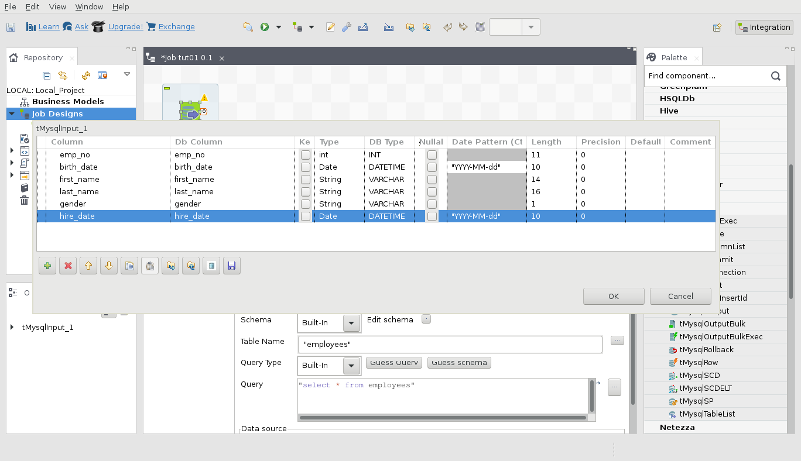

That's all for MySQL, now lets configure CouchbaseOutput component. But before that,
make sure you have a bucket, called `employees` on your local cluster with enough capacity
to keep the data in memory, 200 MB should be enough. CouchbaseOutput component lives
in "Database\Couchbase" category on the palette.

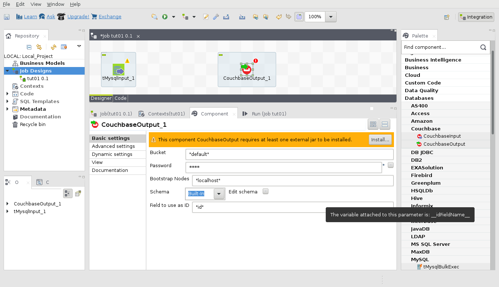

If you running it first time, you will likely need to install additional jars if the
component asks you. In this case click "Install..." and follow installation instructions.
Now select `tMysqlInput_1` component and pull the connector line from its right side and
drag to `CouchbaseOutput_1`. The components should be now connected.

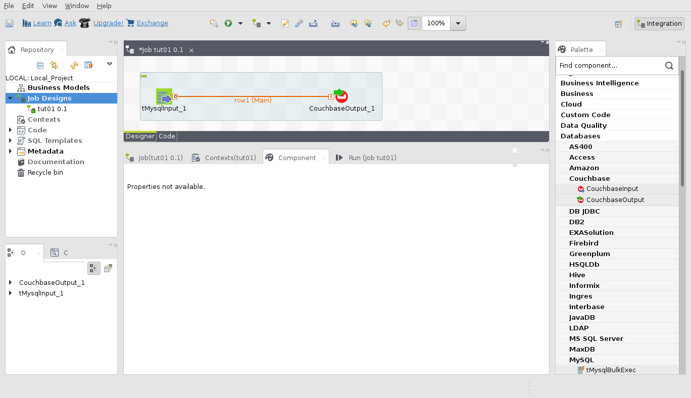

To setup CouchbaseOutput component, click on its icon, and fill in the properties:

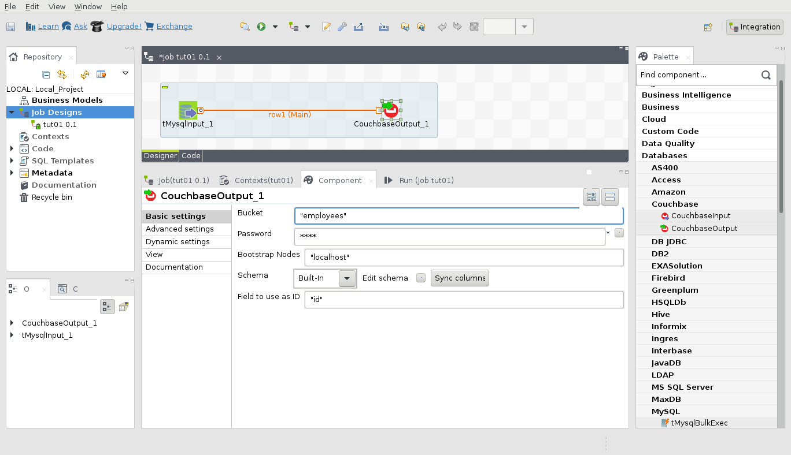

Click to "Sync columns" buttom to propagate outgoing schema from MySQL component to
incoming schema of Couchbase component. Currently incoming schema of CouchbaseOutput
component limited with default Avro encoders, so make sure that generated schema
uses only primitives (e.g. does not have List from Talend Schema or java.sql.Date).
In our case, we have to fix date types after MySQL schema. So click small button
on the right side of "Edit schema" label and update types for `birth_date` and
`hire_date` to be `String`.

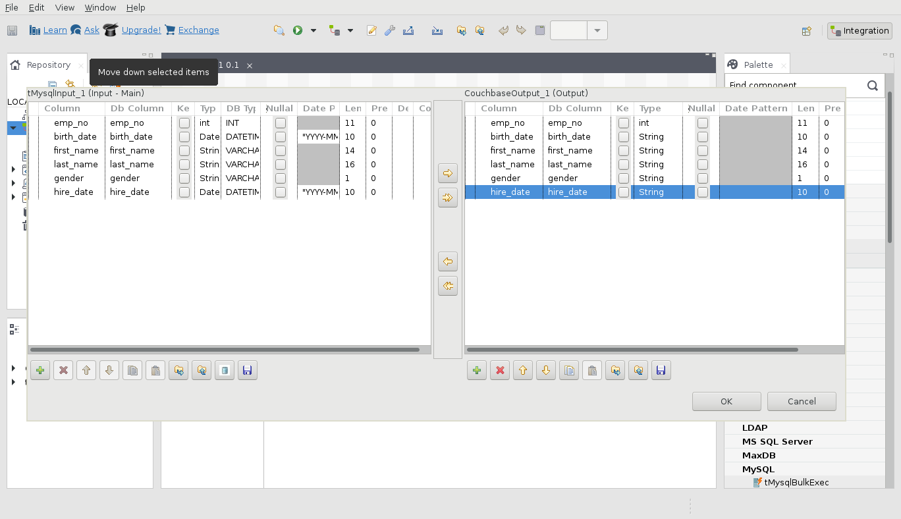

Last thing is to select the field to be document key in the Couchbase bucket. In our
tutorial it should be `"emp_no"`. The value of this field will be stringified.

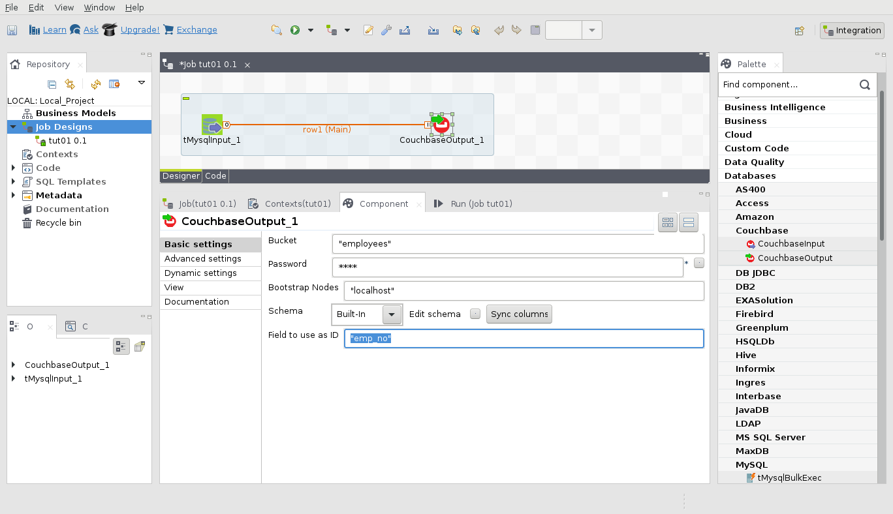

Now everything is ready. Lets switch to "Run" tab, and click "Run" button:

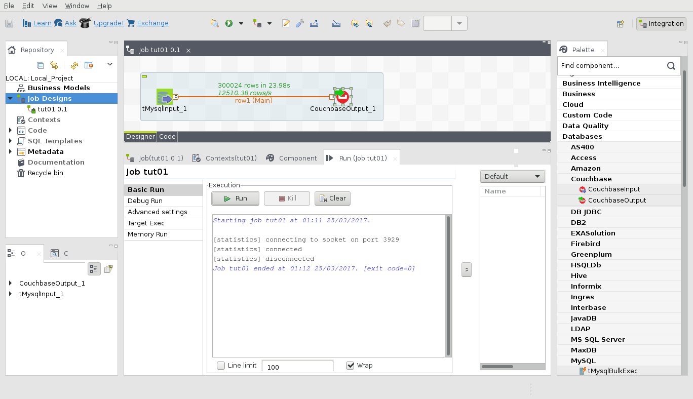

After a while all 300024 document will be transferred to your Couchbase bucket.

## Dumping Couchbase bucket into Talend component

The second component will be useful if you need to extract data from Couchbase for
some analysis or transformation with Talend.

Lets see how to do it. As a first step, create new job and drag "CouchbaseInput"
component from "Databases\Couchbase" category on the palette:

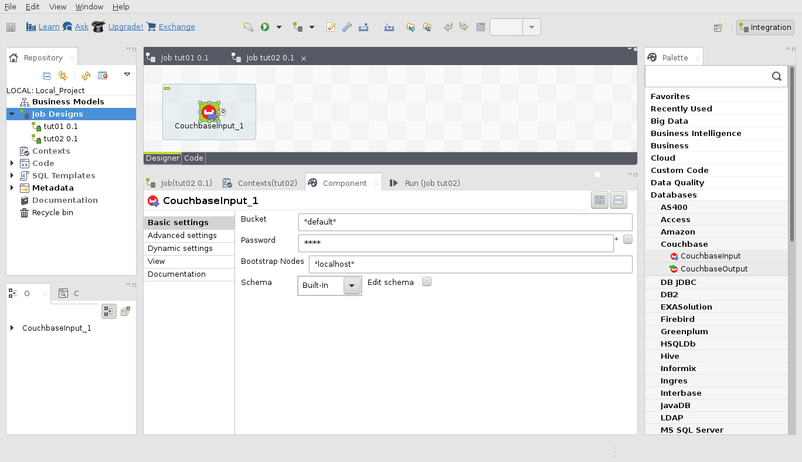

As in previous configure credentials for your Couchbase bucket. Input component
does not allow to customize its outgoing schema directly (but you can do it by
attaching other components to it). Click "Edit schema" to see how the row look
like:

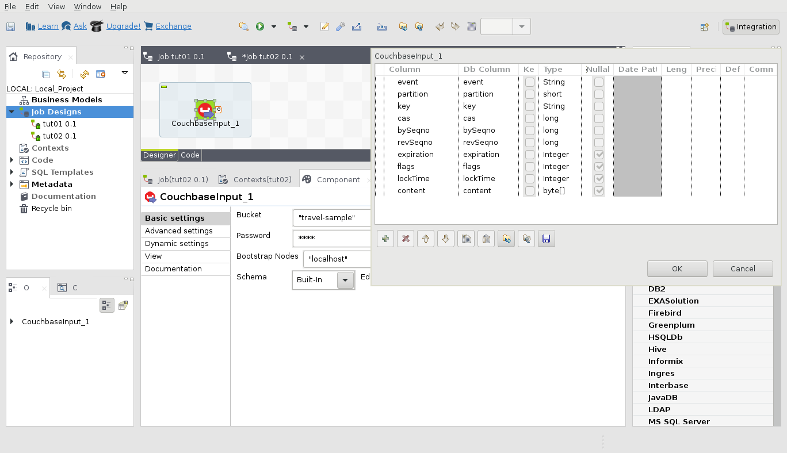

The most interesting there are `key` and `contents`, but let output everything
from `travel-sample` bucket using "tLogRow" component which lives in "Logs & Errors"
category. Put it on the canvas, and connect to "CouchbaseOutput"

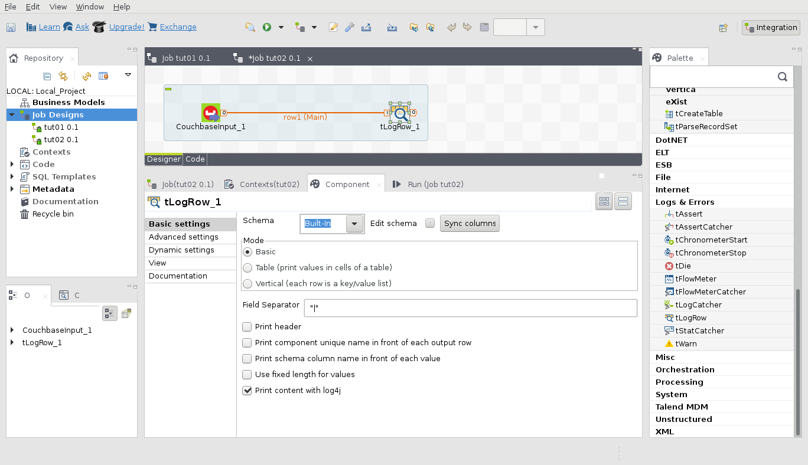

Defaults of "tLogRow" should be enough, but before running, lets set limit for
output to 100, as intensive writes to output widget might make Studio unresponsive
for a while. Once you click "Run", you should see the content of the bucket
as on screenshot below:

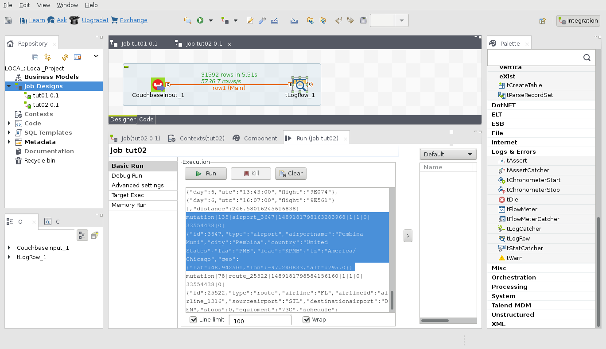

That's it.

## Known Issues

As for developer preview, there is an issue with job serializing, which makes
them unreadable by Studio after you close the job (if the Couchbase component
has been placed to it). This issue recorded as [TALENDC-5](https://issues.couchbase.com/browse/TALENDC-5)
and will be resolved before GA release.
