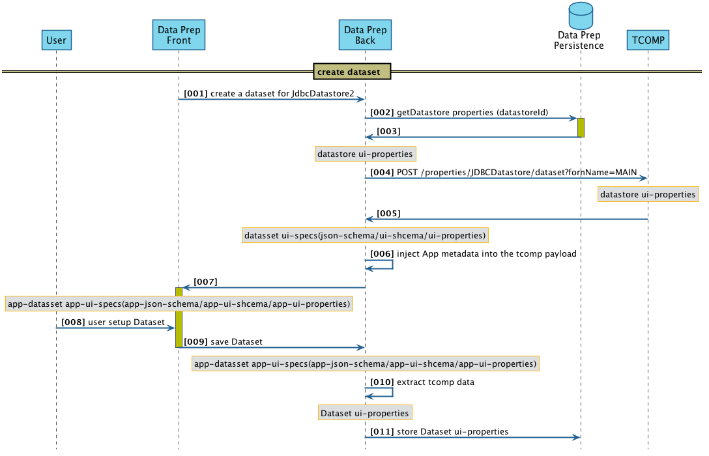
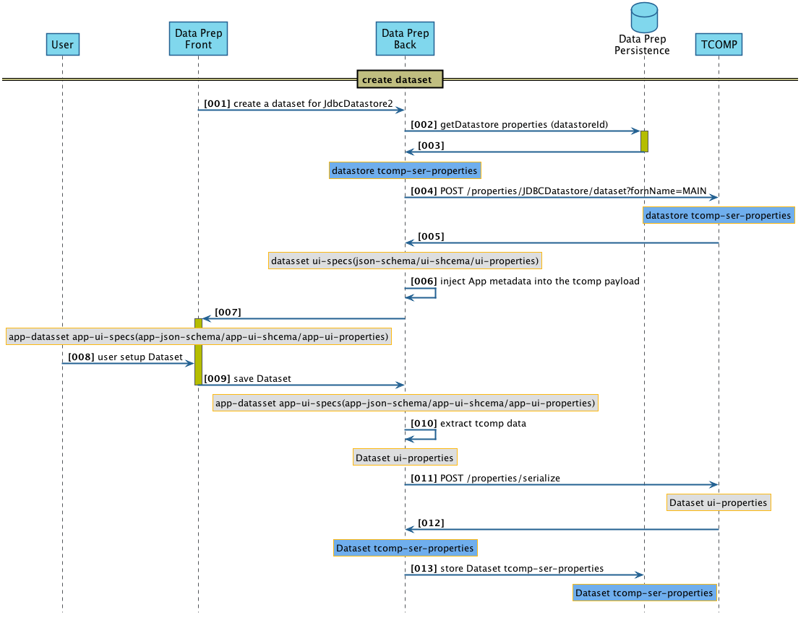

Creating a Dataset instance
=====================

here we can see how Data Stream and Data Prep are using tcomp for creating a dataset. This document will focus on the tcomp interaction and the serialization/storage process done by the middleware to show that today's approach is costly and hard to maintain.

### 1) Today June 2017 sequence diagrams and the storage issues.
Summary
* **[003]** retrieve datastore properties from persistent storage in the form of a *ui-properties*.
* **[004]** Get the UI specs for that dataset from TCOMP. 
* **[008]** The user modify them.
* **[011]** The dataset *ui-properties* are persisted.

The issues with this storage approach is that the Middleware do not have knowledge of the field types and for example do not know which one should be encrypted before storage for security reasons but tcomp knows.
Another issue is the Migration path, not enought information is stored in the *ui-properties* in order to let tcomp migrate the data.

This leads to the conclusion that the data format used to store the properties by the middleware application is not the right one. 
 

### 2) The proposed solution for a proper storage sequence
in  blue the payload is a serialized version of the properties that is ecrypted, can be migrated and is compatible with the Studio persistence.
Summary
* **[003]** retrieve datastore properties from persistent storage in the form of a *tcomp-ser-properties*.
* **[004]** Get the UI specs for that dataset from TCOMP. 
* **[008]** The user modify them.
* **[011] get the serialized version of the *ui-properties* from TCOMP.**
* **[013]** Store the *tcom-ser-properties*.

here the is an extra call from the middleware to tcomp in order to have a proper serializable payload  that will have encrypted field whenever required, a migration path already implemented and a compatiblity with studio persistance.
 

